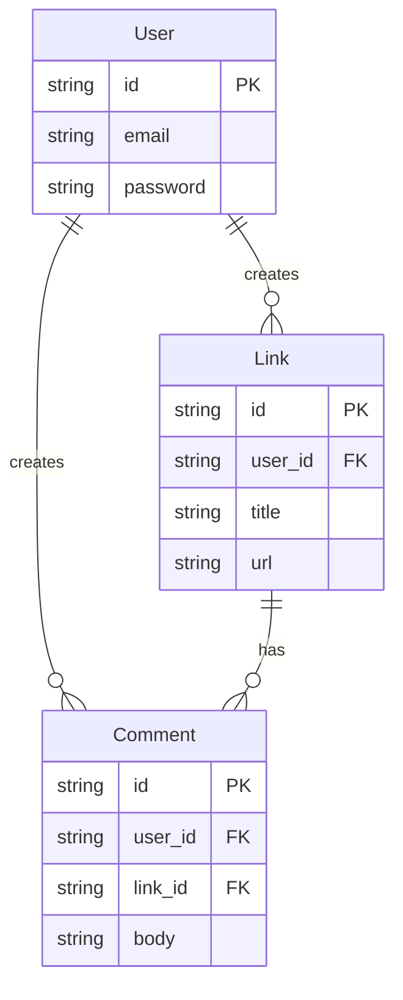

# Link Sharing App

A basic Ruby on Rails app for sharing links, commenting, and voting.

## Getting Started

1. **Requirements:**
   - Ruby
   - Rails
   - SQLite3

2. **Setup:**

   ```
   bundle install
   bin/rails db:create db:migrate
   ```

3. **Run the App:**

   ```
   bin/rails server
   ```

   Visit http://localhost:3000

4. **Run Tests:**
   ```
   bin/rails test
   ```

## Features

- User authentication
- Share links
- Comment on links
- Upvote/downvote links

##

## Database Schema


